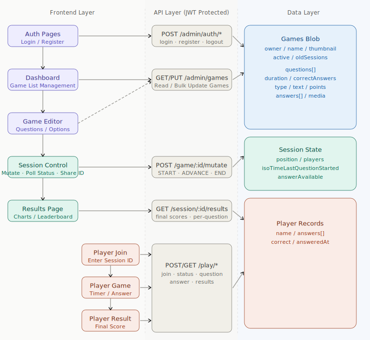

# BigBrain

A full-stack real-time quiz platform inspired by Kahoot. Admins create and host quiz sessions while players join and answer questions live with a countdown timer.

> Built on top of a course-provided backend scaffold — independently redesigned and extended the frontend, and refactored the backend to fit custom game logic.

---

## Architecture



---

## Backend

### Tech Stack

| Category | Details |
|---|---|
| Language | JavaScript (Node.js) |
| Framework | Express.js |
| Auth | JSON Web Token (JWT) |
| Data | File-based JSON store (`database.json`) |
| API Docs | Swagger UI (`/docs`) |
| Testing | Jest + Supertest |
| Other | `async-lock` for concurrent write safety, `cors`, `body-parser` |

### API Endpoints

| Method | Endpoint | Description |
|---|---|---|
| POST | `/admin/auth/register` | Register a new admin account |
| POST | `/admin/auth/login` | Admin login, returns JWT token |
| POST | `/admin/auth/logout` | Admin logout |
| GET | `/admin/games` | Fetch all games owned by the admin |
| PUT | `/admin/games` | Update the full games list |
| POST | `/admin/game/:gameid/mutate` | Start, advance, or end a game session |
| GET | `/admin/session/:sessionid/status` | Get current session state (active question, timer) |
| GET | `/admin/session/:sessionid/results` | Get final results for all players |
| POST | `/play/join/:sessionid` | Player joins a session by name |
| GET | `/play/:playerid/status` | Poll whether the game has started |
| GET | `/play/:playerid/question` | Get the current question for a player |
| GET | `/play/:playerid/answer` | Get the player's submitted answer |
| PUT | `/play/:playerid/answer` | Submit or update a player's answer |
| GET | `/play/:playerid/results` | Get a player's personal results after game ends |

### Highlights

- **Swagger UI** available at `/docs` for interactive API exploration during development
- **`async-lock`** prevents race conditions when multiple players submit answers simultaneously to the shared JSON store
- **Stateless JWT auth** — tokens are never stored server-side; each request is verified via secret signature

---

## Frontend

### Tech Stack

| Category | Details |
|---|---|
| Language | JavaScript (ES2022+) |
| Framework | React 18 |
| Build Tool | Vite |
| Styling | Tailwind CSS 4 |
| Routing | React Router 7 |
| HTTP | Axios |
| Charts | Recharts |
| Testing | Vitest + React Testing Library + Cypress |

### Pages & Features

| Page | Route | Description |
|---|---|---|
| **Login** | `/` | Admin login with JWT token storage |
| **Register** | `/register` | New admin registration |
| **Dashboard** | `/dashboard` | View all games, create or delete games |
| **Edit Game** | `/game/:gameId` | Manage questions in a game, add/delete questions |
| **Edit Question** | `/game/:gameId/question/:questionId` | Edit an individual question's full details |
| **Join Game** | `/play/join` | Player enters session ID and display name |
| **Play Game** | `/play/:sessionId` | Player answers questions with live countdown timer |
| **Player Result** | `/play/:sessionId/result` | Player sees their personal score breakdown |
| **Result (Admin)** | `/result/:sessionId` | Admin views full results with bar chart per question |

### Key Components

- **`QuestionFormFields`** — shared form UI for both Add and Edit question flows
- **`SessionButton`** — controls START / ADVANCE / END game session lifecycle
- **`AnswerButton`** — handles single, multiple, and judgement answer selection with visual feedback
- **`MediaInput`** — supports embedding image URLs or YouTube video links into questions
- **`Modal`** — reusable overlay with configurable title, body, error display, and footer actions
- **`GameCard`** — displays game summary with start and delete actions

### Custom Hooks

| Hook | Purpose |
|---|---|
| `useQuestionForm` | Manages all question form state (text, duration, answers, type, media, points, validation) |
| `useGames` | Reads and writes game data via the admin API |
| `useSessionStatus` | Polls admin session status every 500ms for live game hosting |

### Highlights

**Technical**
- **Server-synced countdown timer** — computed from `isoTimeLastQuestionStarted` returned by the API, not local `Date.now()`, preventing timer drift across clients
- **Real-time polling without WebSockets** — 500ms polling loop on both admin and player sides keeps all clients in sync with zero infrastructure overhead
- **Modular question form** — `useQuestionForm` hook + `QuestionFormFields` component are shared across EditGame (modal) and EditQuestion (full page), eliminating duplicated state and validation logic
- **Three question types** — `single`, `multiple`, and `judgement` each use different answer selection UX and correctness scoring
- **Dual-role routing** — admin and player flows are fully separated with independent API access patterns

**UX / Bug Fixes**
- Modal closes eagerly before the async `updateGame()` call resolves, so the UI never gets stuck open on a network error
- Validation guard on the Add Question modal prevents submitting incomplete questions (text, duration, points, and at least one correct answer are all required)
- Answer inputs enforce a minimum of 2 and a maximum of 6 options, with delete buttons only appearing when there are more than 2
- Active question type and correct answer buttons use distinct color highlights to reduce selection errors during question creation

---

## Testing

### Unit / Component Tests (Vitest + React Testing Library)

| File | What it covers |
|---|---|
| `useQuestionForm.test.js` | Initial state, all validate() branches, reset() |
| `QuestionFormFields.test.jsx` | Type selector, judgement mode, answer list, add/delete answer, limits |
| `AnswerButton.test.jsx` | Single, multiple, judgement selection states |
| `Modal.test.jsx` | Open/close rendering, error display, footer slot |
| `NavBar.test.jsx` | Render, logout callback |
| `CreateGameModal.test.jsx` | Input binding, submit and cancel callbacks |
| `DeleteGameModal.test.jsx` | Confirm and cancel behavior |
| `MediaInput.test.jsx` | URL input, YouTube embed preview |

### E2E Tests (Cypress)

| File | What it covers |
|---|---|
| `AdminWorkflow.cy.js` | Register → create game → add question → start → advance → end |
| `PlayerWorkflow.cy.js` | Join session → wait for start → answer question → view results |

> Player E2E uses `cy.request()` to set up the game via the API directly, making the test independent of the admin UI.

---

## Database

The backend uses a lightweight file-based store at `backend/database.json`. It is auto-created on first server startup.

```bash
# Start the backend (creates database.json if missing)
cd backend && npm run start

# Reset / reinitialize the database
cd backend && npm run reset   # if a reset script is configured
```

The file stores admin accounts, game definitions, session state, and player answers. It is not suitable for production use — replace with a real database for any deployed version.
